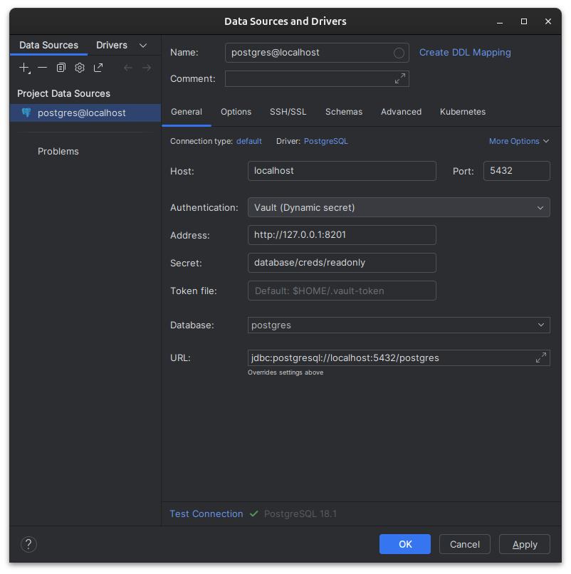
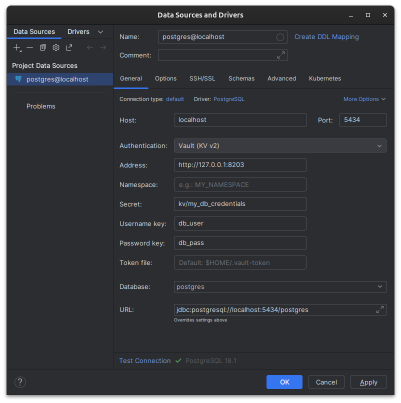

# datagrip-vault-plugin

<!-- Plugin description -->

This plugin provides database credentials using [Vault dynamic secrets](https://www.vaultproject.io/docs/secrets/databases) and [KV v2](https://developer.hashicorp.com/vault/docs/secrets/kv/kv-v2) secrets.

Vault login is not handled by this plugin. 

You should manually log in into Vault, which will, using the default [Token Helper](https://www.vaultproject.io/docs/commands/token-helper), create a Vault token file in `$HOME/.vault-token`. Check another [Vault Token Helper](https://github.com/joemiller/vault-token-helper) with support for native secret storage on macOS, Linux, and Windows.

The Dynamic secret Auth provider on this plugin will cache credentials in memory until it expires.

Authentication options:
- Vault (Dynamic secret): for Vault Database secrets engine dynamic credentials.
- Vault (KV v2): for KV v2 mounts, with configurable username/password keys.

<!-- Plugin description end -->

## Installation

- Using IDE built-in plugin system:
  
  <kbd>Settings/Preferences</kbd> > <kbd>Plugins</kbd> > <kbd>Marketplace</kbd> > <kbd>Search for "datagrip-vault-plugin"</kbd> >
  <kbd>Install Plugin</kbd>
  
- Manually:

  Download the [latest release](https://github.com/premium-minds/datagrip-vault-plugin/releases/latest) and install it manually using
  <kbd>Settings/Preferences</kbd> > <kbd>Plugins</kbd> > <kbd>⚙️</kbd> > <kbd>Install plugin from disk...</kbd>

## Screenshots

## Local testing

Use the helper scripts to start/stop local Vault dev servers with Postgres:

- Dynamic secrets example:
  - Start: `./docker-postgres-vault-example.sh`
  - Stop: `./docker-postgres-vault-example.sh --stop`
- KV v2 example:
  - Start: `./docker-postgres-vault-kv2-example.sh`
  - Stop: `./docker-postgres-vault-kv2-example.sh --stop`

## Limitations

Support for parsing Vault config file from environment variable `VAULT_CONFIG_PATH` or default `~/.vault` is restricted to [JSON syntax](https://github.com/hashicorp/hcl/blob/main/json/spec.md) only. It does not support [native HCL syntax](https://github.com/hashicorp/hcl/blob/main/hclsyntax/spec.md). 

## Configuration

This plugin reads extra connection properties from the DataGrip/IntelliJ data source:

- `vault_address` (optional): Vault address. If not set, falls back to `VAULT_AGENT_ADDR` and then `VAULT_ADDR`.
- `vault_secret` (required): Vault secret path.
- `vault_namespace` (optional): Vault namespace. If not set, falls back to `VAULT_NAMESPACE`.
- `vault_token_file` (optional): Vault token file path. If not set, falls back to Vault token helper configured in `~/.vault` (JSON only), and then `~/.vault-token`.
- `vault_username_key` (KV v2 only, optional): Key name for the username field inside the KV v2 secret. Defaults to `username`.
- `vault_passwd_key` (KV v2 only, optional): Key name for the password field inside the KV v2 secret. Defaults to `password`.

### `vault_secret` examples

The meaning of `vault_secret` depends on which Vault secrets engine you’re reading:

- Dynamic database credentials (Vault Database secrets engine):
  - Example: `database/creds/my-role`
  - Response shape: `data.username` / `data.password`

- KV v2 secrets engine (use Vault (KV v2)):
  - Read endpoint must include `/data/`:
    - Example: `kv_customer/data/my_db_credentials`
  - The plugin also tolerates v1-style KV paths by rewriting:
    - `kv_customer/my_db_credentials` → `kv_customer/data/my_db_credentials`
  - Response shape wraps credentials under `data.data.<username_key>` / `data.data.<password_key>`.
