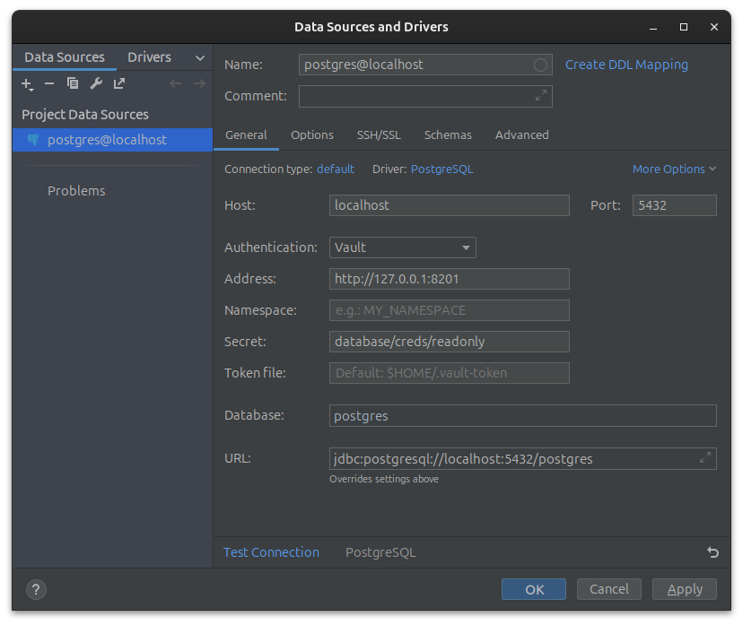

# datagrip-vault-plugin


[](https://plugins.jetbrains.com/plugin/18522)
[](https://plugins.jetbrains.com/plugin/18522)

<!-- Plugin description -->

This plugin provides database credentials using [Vault dynamic secrets](https://www.vaultproject.io/docs/secrets/databases). 

Vault login is not handled by this plugin. 

You should manually log in into Vault, which will, using the default [Token Helper](https://www.vaultproject.io/docs/commands/token-helper), create a Vault token file in `$HOME/.vault-token`. Check another [Vault Token Helper](https://github.com/joemiller/vault-token-helper) with support for native secret storage on macOS, Linux, and Windows.

This plugin will cache credentials in memory until it expires.

<!-- Plugin description end -->

## Installation

- Using IDE built-in plugin system:
  
  <kbd>Settings/Preferences</kbd> > <kbd>Plugins</kbd> > <kbd>Marketplace</kbd> > <kbd>Search for "datagrip-vault-plugin"</kbd> >
  <kbd>Install Plugin</kbd>
  
- Manually:

  Download the [latest release](https://github.com/premium-minds/datagrip-vault-plugin/releases/latest) and install it manually using
  <kbd>Settings/Preferences</kbd> > <kbd>Plugins</kbd> > <kbd>⚙️</kbd> > <kbd>Install plugin from disk...</kbd>

## Screenshots




## Limitations

Support for parsing Vault config file from environment variable `VAULT_CONFIG_PATH` or default `~/.vault` is restricted to [JSON syntax](https://github.com/hashicorp/hcl/blob/main/json/spec.md) only. It does not support [native HCL syntax](https://github.com/hashicorp/hcl/blob/main/hclsyntax/spec.md). 

## Configuration

This plugin reads extra connection properties from the DataGrip/IntelliJ data source:

- `vault_address` (optional): Vault address. If not set, falls back to `VAULT_AGENT_ADDR` and then `VAULT_ADDR`.
- `vault_secret` (required): Vault secret path.
- `vault_namespace` (optional): Vault namespace. If not set, falls back to `VAULT_NAMESPACE` and then the JSON Vault config file (`$VAULT_CONFIG_PATH` or `~/.vault`).
- `vault_token_file` (optional): Vault token file path. If not set, falls back to Vault token helper configured in `~/.vault` (JSON only), and then `~/.vault-token`.

### `vault_secret` examples

The meaning of `vault_secret` depends on which Vault secrets engine you’re reading:

- Dynamic database credentials (Vault Database secrets engine):
  - Example: `database/creds/my-role`
  - Response shape: `data.username` / `data.password`

- KV v2 secrets engine:
  - Read endpoint must include `/data/`:
    - Example: `kv_customer/data/my_db_credentials`
  - The plugin also tolerates v1-style KV paths by rewriting:
    - `kv_customer/my_db_credentials` → `kv_customer/data/my_db_credentials`
  - Response shape wraps credentials under `data.data.username` / `data.data.password`.

## Development / Testing

### Run the plugin in a sandbox IDE

To test locally without affecting your real IDE config, run:

```bash
./gradlew runIde
```

This starts a separate IDE instance using the sandbox under `build/idea-sandbox/`.

### Build the installable plugin ZIP

To build the plugin artifact that can be installed from disk:

```bash
./gradlew buildPlugin
```

The resulting ZIP is created under:

- `build/distributions/`

### Where to find logs

#### When running via `runIde`

Logs are written to the sandbox system directory:

- `build/idea-sandbox/system/log/idea.log`

Tip: you can also open the log folder from the sandbox IDE via **Help → Show Log in Files**.

#### When installed in your normal IDE

Use **Help → Show Log in Files** in the IDE where the plugin is installed.

On Linux, log files are usually located under:

- `~/.cache/JetBrains/<Product><Version>/log/idea.log`

> Note: be careful enabling verbose logging, as Vault request/response debugging may expose secrets in logs.
